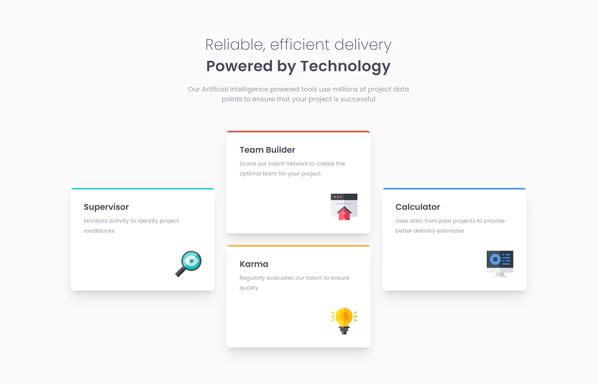

# Frontend Mentor - Four card feature section solution

This is a solution to the [Four card feature section challenge on Frontend Mentor](https://www.frontendmentor.io/challenges/four-card-feature-section-weK1eFYK). Frontend Mentor challenges help you improve your coding skills by building realistic projects.

## Table of contents

- [Overview](#overview)
  - [The challenge](#the-challenge)
  - [Screenshot](#screenshot)
  - [Links](#links)
- [My process](#my-process)
  - [Built with](#built-with)
- [Available Scripts](#available-scripts)
- [Author](#author)

## Overview

### The challenge

Users should be able to:

- View the optimal layout for the site depending on their device's screen size

### Screenshot

### Links

- [Solution URL](https://www.frontendmentor.io/solutions/four-card-feature-section-using-tailwind-css-BJcMlhlm5)
- [Live Site UR](https://frontendmentor-four-card-feature-section-pink.vercel.app/)

## My process

### Built with

- Semantic HTML5 markup
- Flexbox
- CSS Grid
- Mobile-first workflow
- [Tailwind CSS](https://tailwindcss.com/)

## Available Scripts

In the project directory, you can run:

### `npx tailwindcss -i ./src/input.css -o ./dist/output.css --watch`

Start the Tailwind CLI build process
Run the CLI tool to scan the template files for classes and build the CSS output file.

## Author

- Frontend Mentor - [@feralba28](https://www.frontendmentor.io/profile/feralba28)
- Linkedin - [Fernando Alba](https://www.linkedin.com/in/alba-fernando/)
